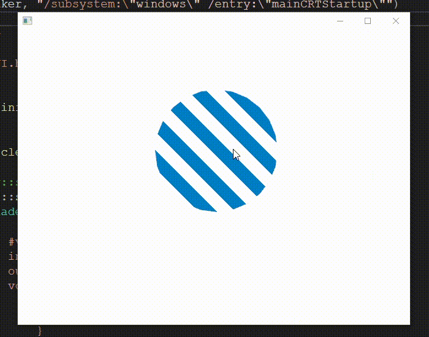

# NodeUI
大学1年のときに作成した、OpenGLを用いたGUI開発環境の雛形です。
以前にも似たものとして[UILib](https://github.com/wakewakame/UILib)を開発していましたが、それの後継にあたります。
また、開発環境の再現ができなくなったため、大学4年のときにCMakeで環境構築するように変更しました。
(C++の部分はほとんど変更していません)

# ビルド方法&実行方法
gitとcmakeが必要になります。  

```
$ git clone https://github.com/wakewakame/NodeUI
$ cd NodeUI
$ git submodule update --init --recursive
$ mkdir build && cd build
$ cmake ..
$ make
$ ./NodeUI
```
